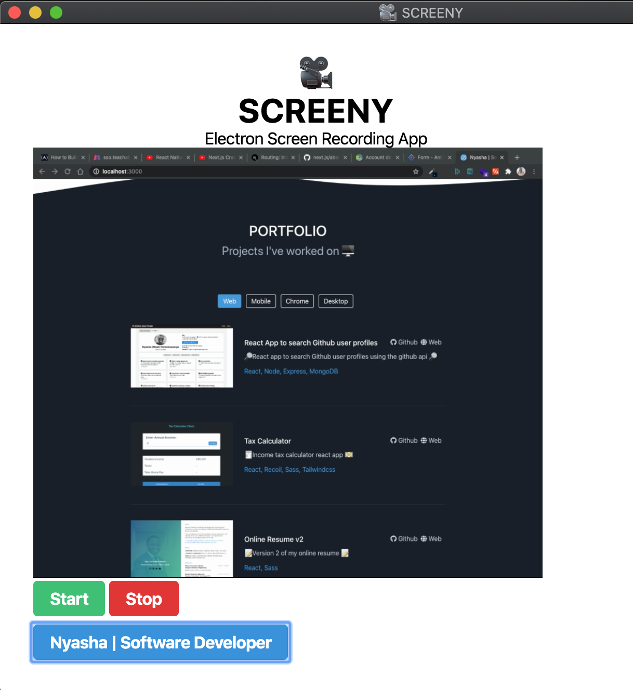

# Screeny Desktop App

🎥 Screen recording desktop app built with Electron 🖥️



## Getting Started

```bash
$ cd screeny

# Start app
$ npm install
$ npm start

# No hot-reloading so make changes and type 'rs' for reload
$ rs

# Build executable
$ npm run make

```

## Built with

- [Electron](https://www.electronjs.org/)

## Reference

- [Electron forge boilerplate](https://www.electronforge.io/)
- [Build a Desktop App with Electron (Video)](https://www.youtube.com/watch?v=3yqDxhR2XxE)
